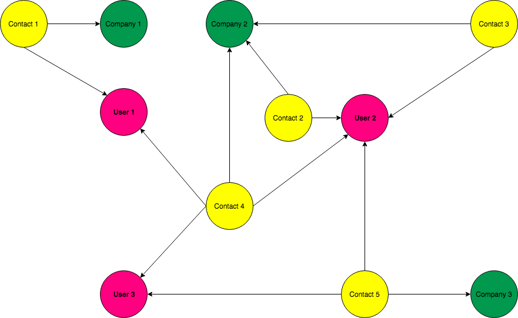
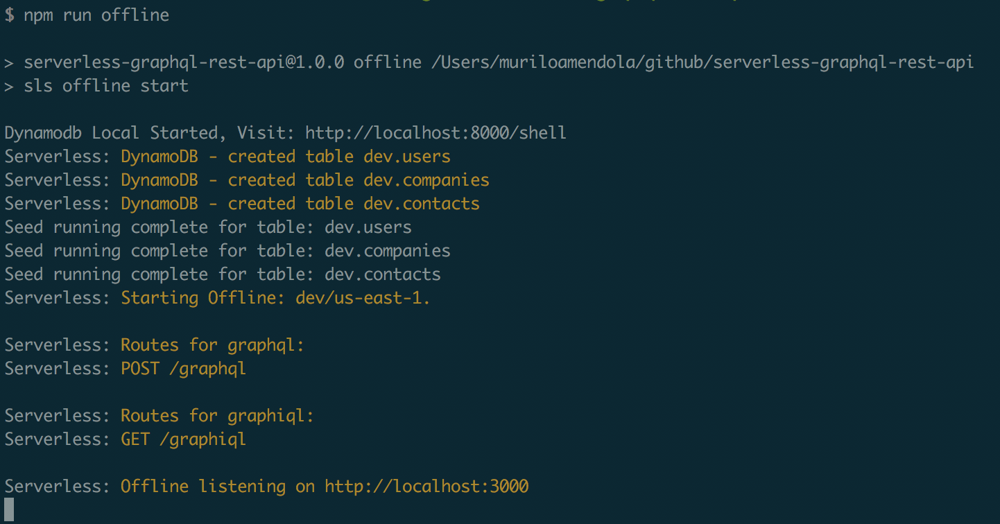
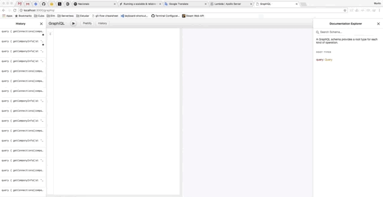

serverless-graphql-rest-api
===========================

The main porpuse of this repo is be a sample of how to integrate Apollo Server + GraphQL + Serverless Architecture. For this we have created a search API thought a schema like following:



To summarize we have 3 entities: User, Company and Contacts. So, if I wish retrieve all the contacts of a specific company, how could I do it? This question will be answered by this code.

# Dependencies

* [Serverless framework](https://serverless.com)
  * [serverless-offline](https://github.com/dherault/serverless-offline) 
  * [serverless-dynamodb-local](https://github.com/99xt/serverless-dynamodb-local) 
* [Apollo Server - Lambda](https://www.apollographql.com/docs/apollo-server/servers/lambda.html)

To understand the concepts and code implemented in this repo it's necessary a basic knowledge of GraphQL, Serverless Architecture and Node.js programming language.

# Running

After clone this repo in your computer, go to project folder and install dependencies using the following command:

```bash
npm i
```

After all dependencies have installed you can run the project throught the command:

```bash
npm run offline
```

If everything was fine you could see a screen like this:



# Implementation

This implementation was based on the post [Running a scalable & reliable GraphQL endpoint with Serverless](https://serverless.com/blog/running-scalable-reliable-graphql-endpoint-with-serverless/).

Basically, the project contains two handlers, as you can see at [serverless.yml](./serverless.yml) file:

* `graphql`: whose implementation is in [handler.js](./handler.js) file, more specifically at line 11. This handler is responsible to process requests throught GraphQL using apollo-server-lambda implementation. In other words is the Backend API of our project.
* `graphiql`: whose implementation is in [handler.js](./handler.js) file, more specifically at line 25. This handler returns a GraphQL Client implementation called graphiql. Where you can write your queries and see the results.

Other important files are:

* [schema.js](./schema.js): Where we define the GraphQL types, queries, mutations and subscriptions, which makes up the GraphQL Schema.
* [resolvers.js](./resolvers.js): The implementation of GraphQL resolvers based on types and queries defined at `schema.js`.
* [repository](./repository/): The repository folder contains the code to integrate with data layer. We have used DynamoDB to persist data.
* [seed-data](./seed-data/): The seed-data folder contains sample data used on offline mode. See `serverless-dynamodb-local` for more information.

# See it in action

Just open the link `http://localhost:3000/graphiql` in your browser.



# Next steps

* Compares [Apollo Engine](https://www.apollographql.com/docs/engine/setup-lambda.html) and [AppSync](https://hackernoon.com/running-a-scalable-reliable-graphql-endpoint-with-serverless-24c3bb5acb43) to manage cache and metrics about the GraphQL API
* Reimplement this project using some GraphDB
  * Amazon Neptune: until now (04/19/2018) neptune is only available for whitelisted users and there is no integration from Lambda functions. To request a preview for Neptune [click here](https://pages.awscloud.com/NeptunePreview.html).
  * Neo4j: It's a good option, but, AWS there is no a managed service for neo4j. So you have to install and mantain it in a EC2 instance.

# About

* devs@cubo.network